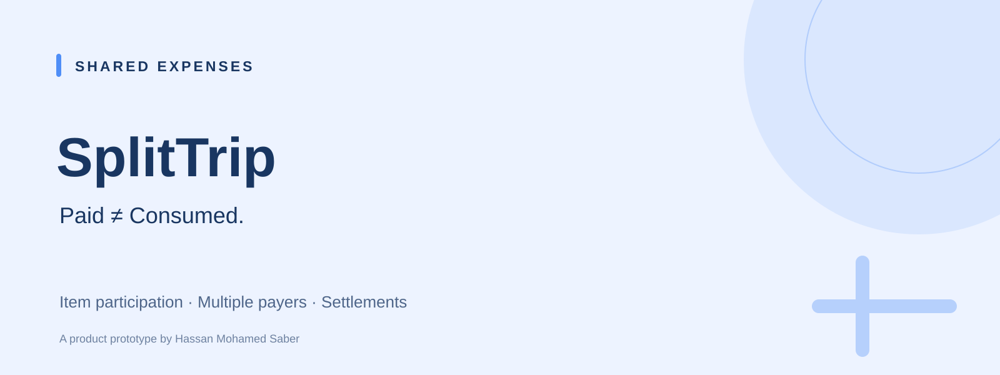
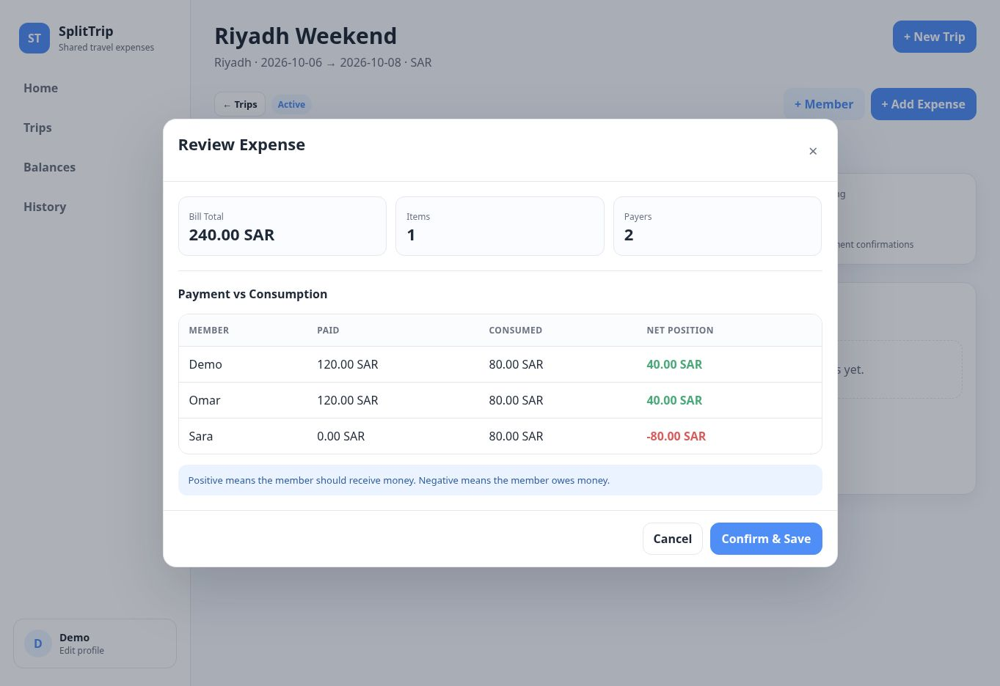
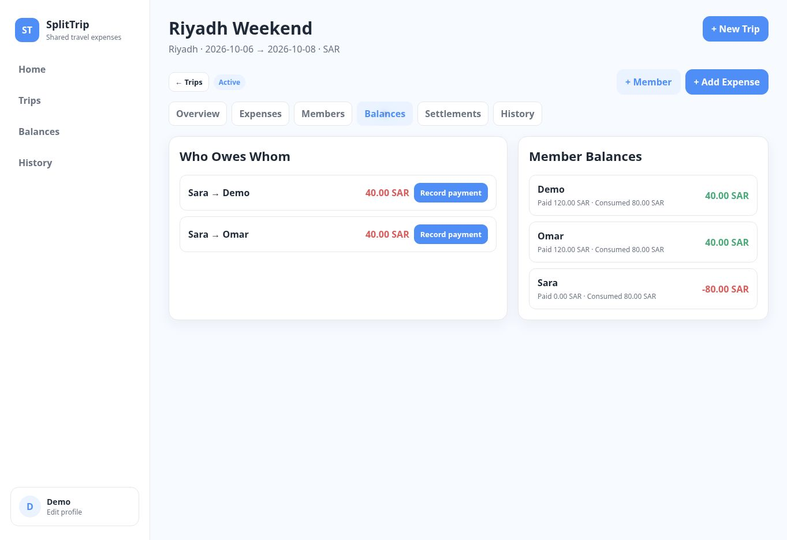

# SplitTrip

**Split what people actually consumed, independently of who paid.**

[**Live Demo →**](https://hassansaber1911-dot.github.io/Splittrip/)

## Product Preview

Real screenshots from the live application using sample participants and amounts.

### Review payment versus consumption

### See who owes whom

## The problem
Equal splits break down when people order different items, skip activities or fund the same bill together. A fair calculation needs separate payment and consumption records.

## MVP and user flow
Create a trip → add members → enter items and their consumers → record one or more payers → review the allocation → save → inspect balances → record and confirm repayments.

- Item-level participation.
- Multiple payers on one expense.
- Tax, service and other fee allocation.
- Member balances and settlement suggestions.
- Full or partial repayments with confirmation.
- Trip and expense history.

## Business rules and product decisions
**Paid ≠ Consumed.** A member's position compares what they funded with their allocated consumption.

**Participation belongs to the item.** Skipping an item should not require an exception to a blanket equal split.

**Repayment is a separate record.** Settlement changes the balance while preserving the original expense history; confirmation distinguishes a recorded payment from an accepted one.

## Validation
Live flow checked on 6 October 2026. A **240 SAR** shared item with three consumers and two **120 SAR** payers produced positions of **+40, +40 and −80 SAR**, and two repayment suggestions of **40 SAR**. A **20 SAR** partial settlement was recorded and confirmed.

## Measurement and current limits
The prototype includes GA4 instrumentation; no adoption or outcome metrics are claimed. Records persist locally in the browser. There are no shared accounts, real-time collaboration, currency conversion or actual money transfers.

---
Built by **Hassan Mohamed Saber** · Product portfolio
